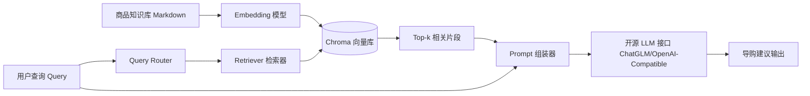

# 模拟 AI 购物代理系统架构图

```mermaid
flowchart LR
    A[用户查询 Query] --> B[Query Router]
    B --> C[Retriever 检索器]
    D[商品知识库 Markdown] --> E[Embedding 模型]
    E --> F[(Chroma 向量库)]
    C --> F
    F --> G[Top-k 相关片段]
    G --> H[Prompt 组装器]
    A --> H
    H --> I[开源 LLM 接口 ChatGLM/OpenAI-Compatible]
    I --> J[导购建议输出]
```

## 模块说明

- `Ingestion`：读取三类商品知识文本并切分。
- `Embedding`：使用多语言向量模型将文本编码。
- `Vector Store`：使用 Chroma 持久化索引。
- `Retriever`：按语义相似度召回 top-k 文档块。
- `Generator`：将查询+上下文喂给 LLM，输出推荐建议。
